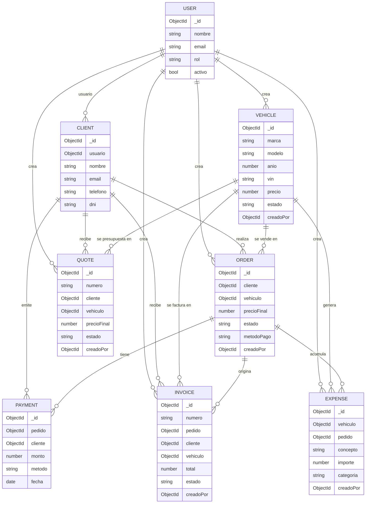

# Diagrama Entidad-Relacion (E-R)

Este diagrama representa el modelo principal de datos del backend (MongoDB/Mongoose).

```mermaid
erDiagram
  USER {
    ObjectId _id
    string nombre
    string email
    string rol
    bool activo
  }

  CLIENT {
    ObjectId _id
    ObjectId usuario
    string nombre
    string email
    string telefono
    string dni
  }

  VEHICLE {
    ObjectId _id
    string marca
    string modelo
    number anio
    string vin
    number precio
    string estado
    ObjectId creadoPor
  }

  ORDER {
    ObjectId _id
    ObjectId cliente
    ObjectId vehiculo
    number precioFinal
    string estado
    string metodoPago
    ObjectId creadoPor
  }

  QUOTE {
    ObjectId _id
    string numero
    ObjectId cliente
    ObjectId vehiculo
    number precioFinal
    string estado
    ObjectId creadoPor
  }

  INVOICE {
    ObjectId _id
    string numero
    ObjectId pedido
    ObjectId cliente
    ObjectId vehiculo
    number total
    string estado
    ObjectId creadoPor
  }

  PAYMENT {
    ObjectId _id
    ObjectId pedido
    ObjectId cliente
    number monto
    string metodo
    date fecha
  }

  EXPENSE {
    ObjectId _id
    ObjectId vehiculo
    ObjectId pedido
    string concepto
    number importe
    string categoria
    ObjectId creadoPor
  }

  USER ||--o{ CLIENT : "usuario"
  USER ||--o{ VEHICLE : "crea"
  USER ||--o{ ORDER : "crea"
  USER ||--o{ QUOTE : "crea"
  USER ||--o{ INVOICE : "crea"
  USER ||--o{ EXPENSE : "crea"

  CLIENT ||--o{ ORDER : "realiza"
  CLIENT ||--o{ QUOTE : "recibe"
  CLIENT ||--o{ INVOICE : "recibe"
  CLIENT ||--o{ PAYMENT : "emite"

  VEHICLE ||--o{ ORDER : "se vende en"
  VEHICLE ||--o{ QUOTE : "se presupuesta en"
  VEHICLE ||--o{ INVOICE : "se factura en"
  VEHICLE ||--o{ EXPENSE : "genera"

  ORDER ||--o{ PAYMENT : "tiene"
  ORDER ||--o{ INVOICE : "origina"
  ORDER ||--o{ EXPENSE : "acumula"
```
